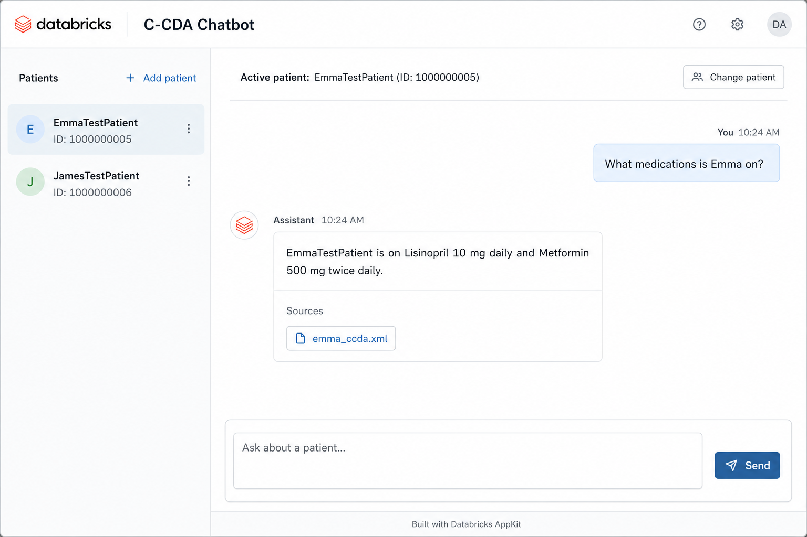
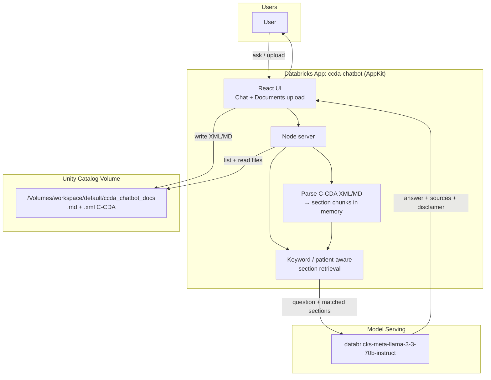

# C-CDA Patient Chatbot (Databricks App)

Working chatbot for HL7 C-CDA health summaries **without Agent Bricks**.

## Example UI

Example question: *What medications is Emma on?*



## Architecture of C-CDA-chatbot



**How it works**

1. Loads **markdown** and **XML C-CDA** files from Unity Catalog volume  
   `/Volumes/workspace/default/ccda_chatbot_docs`
2. Automatically parses uploaded `.xml` C-CDAs into section chunks (multi-patient)
3. Retrieves relevant sections for the named patient / question
4. Calls Foundation Model endpoint `databricks-meta-llama-3-3-70b-instruct`
5. Returns answer + source file list + disclaimer

Upload new C-CDA XML files in the app **Documents** tab — they are indexed on upload and before each chat.

## Run / deploy

```powershell
cd C:\Users\Lenovo\Projects\ccda-chatbot\ccda-chatbot
databricks apps validate --skip-tests --profile dbc-7c3eed4c
databricks apps deploy -t default --profile dbc-7c3eed4c --auto-approve --skip-tests
```

Open the app URL from the Databricks **Apps** page (`ccda-chatbot`).

## Sample questions

- What medications is Emma on?
- What medications is James on?
- List Emma's allergies
- What are James's active problems?
